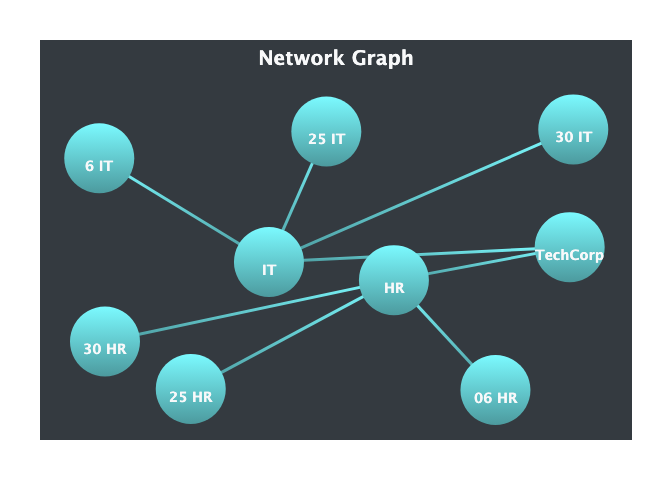

Stephen Elvis Ampah
05.08.2024

``` r
library(highcharter)
```

    ## Registered S3 method overwritten by 'quantmod':
    ##   method            from
    ##   as.zoo.data.frame zoo

    ## Highcharts (www.highcharts.com) is a Highsoft software product which is

    ## not free for commercial and Governmental use

``` r
library(dplyr)
```

    ## 
    ## Attaching package: 'dplyr'

    ## The following objects are masked from 'package:stats':
    ## 
    ##     filter, lag

    ## The following objects are masked from 'package:base':
    ## 
    ##     intersect, setdiff, setequal, union

``` r
library(data.table)
```

    ## 
    ## Attaching package: 'data.table'

    ## The following objects are masked from 'package:dplyr':
    ## 
    ##     between, first, last

``` r
library(webshot2)
library(htmlwidgets)
```

``` r
  # Preparing the data
  XY <- c(0, 2, -3, 4, -2, 6)
  MN <- c(0, 3, 6, 8, 6, 7)
  
  dt <- data.table(
    from = c("TechCorp", "TechCorp", "HR", "IT", "HR", "IT", "HR", "IT"),
    to = c("HR", "IT", "06 HR", "6 IT", "25 HR", "25 IT", "30 HR", "30 IT")
    )
  
  # Create the highchart object
  hc <- highchartzero() %>%
    hc_add_series(
      data = dt,
      type = "networkgraph",
      layoutAlgorithm = list(
        enableSimulation = TRUE,
        integration = "verlet"
      ),
      marker = list(
        symbol = "circle",
        radius = 35,
        lineColor = "none",
        # nodes = nodes,
        fillColor = list(
          linearGradient = list(x1 = 0, y1 = 1, x2 = 0, y2 = 0),
          stops = list(
            c(0, "#4C9A9E"),
            c(1, "#7BFAFF"))),
        states = list(
          hover = list(
            fillColor = "#E91E63",
            lineColor = "none",
            radius = 35
          )
        )
      ),
      
      link = list(
        color = list(
          linearGradient = list(x1 = 0, y1 = 1, x2 = 0, y2 = 0),
          stops = list(
            c(0, "#4C9A9E"),
            c(1, "#7BFAFF"))),
        width = '3'
      ),
      
      dataLabels = list(
        enabled = TRUE,
        style = list(
          color = "#f8f9fa",
          fontSize = "14px",
          fontWeight = "bold",
          textOutline = FALSE
        ),
        
        y = 20,
        linkFormat = ""
      ),
      
      nodes = list(
        list(id = "06 HR", xy = XY[1], mn = MN[1]),
        list(id = "6 IT", xy = XY[2], mn = MN[2]),
        list(id = "25 HR", xy = XY[3], mn = MN[3]),
        list(id = "25 IT", xy = XY[4], mn = MN[4]),
        list(id = "30 HR", xy = XY[5], mn = MN[5]),
        list(id = "30 IT", xy = XY[6], mn = MN[6]),
        list(id = "TechCorp"),
        list(id = "HR"),
        list(id = "IT")
      )
    ) %>%
    
    hc_title(
      text = "Network Graph",
      style = list(
        color = "white",
        fontSize = "20px",
        fontWeight = "bold"
      )
    ) %>%
    
    # Tooltip enables the hovering effect to take place
    hc_tooltip(
      enabled = T,
      useHTML = TRUE,
      formatter = JS(
        "function() {
            if (this.point.id === '06 HR' || this.point.id === '25 HR' || this.point.id === '30 HR' || this.point.id === '6 IT' || this.point.id === '25 IT' || this.point.id === '30 IT') {
              return this.point.name + '<br>XY: ' + this.point.xy + '<br>MN: ' + this.point.mn;
            } else {
              return this.point.name;
            }
          }"
      )
    )%>%
    
    hc_add_dependency(
      "modules/networkgraph.js"
    ) %>%
    
    hc_credits(
      enabled = FALSE
    ) 

    # Save the widget as an HTML file
    saveWidget(hc, "plot.html", selfcontained = FALSE)
    
    # Use webshot to convert it to an image
    webshot2::webshot("plot.html", "plot.png", delay = 5)
```

<!-- -->
