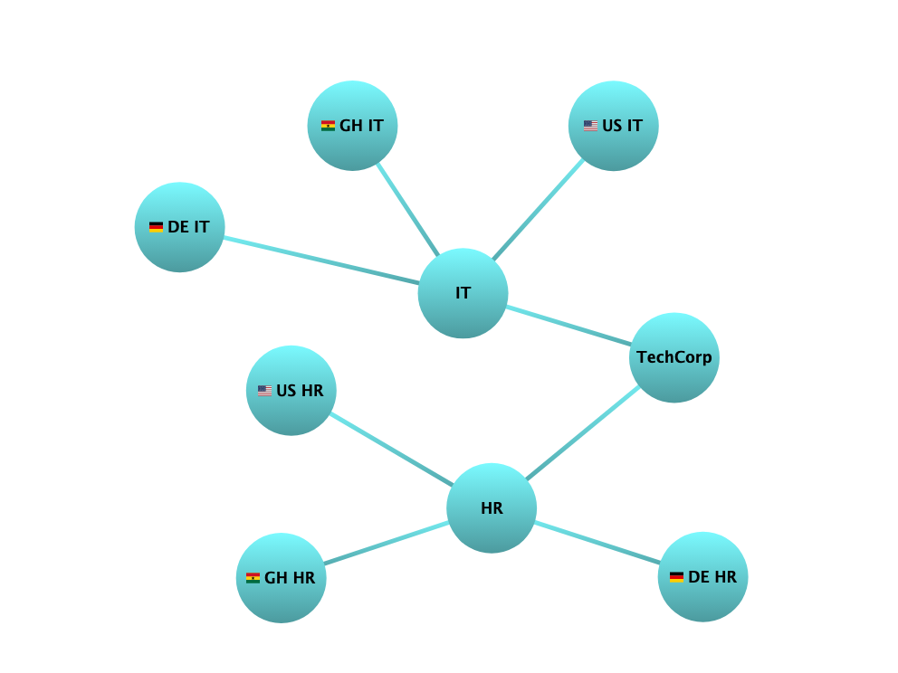

Stephen Elvis Ampah
05.08.2024

``` r
library(highcharter)
```

    ## Registered S3 method overwritten by 'quantmod':
    ##   method            from
    ##   as.zoo.data.frame zoo

``` r
library(dplyr)
```

    ## 
    ## Attaching package: 'dplyr'

    ## The following objects are masked from 'package:stats':
    ## 
    ##     filter, lag

    ## The following objects are masked from 'package:base':
    ## 
    ##     intersect, setdiff, setequal, union

``` r
library(data.table)
```

    ## 
    ## Attaching package: 'data.table'

    ## The following objects are masked from 'package:dplyr':
    ## 
    ##     between, first, last

``` r
library(webshot2)
library(htmlwidgets)
```

``` r
  # Preparing the data
   dt <- data.table(
    from = c("TechCorp", "TechCorp", "HR", "IT", "HR", "IT", "HR", "IT"),
    to = c("HR", "IT", "DE HR", "DE IT", "GH HR", "GH IT", "US HR", "US IT")
    )
  
  # Create the highchart object
  hc <- highchartzero() %>%
  hc_add_series(
    data = dt,
    type = "networkgraph",
    layoutAlgorithm = list(
      enableSimulation = TRUE,
      integration = "verlet"
    ),
    marker = list(
      symbol = "circle",
      radius = 35,
      lineColor = "none",
      # nodes = nodes,
      fillColor = list(
        linearGradient = list(x1 = 0, y1 = 1, x2 = 0, y2 = 0),
        stops = list(
          c(0, "#4C9A9E"),
          c(1, "#7BFAFF"))),
      states = list(
        hover = list(
          fillColor = "#E91E63",
          lineColor = "none",
          radius = 35
        )
      )
    ),
    
    link = list(
      color = list(
        linearGradient = list(x1 = 0, y1 = 1, x2 = 0, y2 = 0),
        stops = list(
          c(0, "#4C9A9E"),
          c(1, "#7BFAFF"))),
      width = '3'
    ),
    
    dataLabels = list(
  enabled = TRUE,
  useHTML = TRUE,
  y = 15,
  linkFormat = "",
  formatter = JS(
    "function() {
      var flagURL = 'https://cdnjs.cloudflare.com/ajax/libs/flag-icon-css/3.4.3/flags/4x3/';
      var countryMap = { 'DE': 'de', 'GH': 'gh', 'US': 'us' };
      var country = this.key.split(' ')[0];
      var flagIcon = countryMap[country] ? '' : '';
      return flagIcon + '<span style=\"vertical-align: middle;\">' + this.key + '</span>';
    }"
  )
),

  ) %>%
  
  hc_title(
    text = "Network Graph",
    style = list(
      color = "white",
      fontSize = "20px",
      fontWeight = "bold"
    )
  ) %>%
  
  # Tooltip enables the hovering effect to take place
  hc_tooltip(
    enabled = T,
    useHTML = TRUE,
    formatter = JS(
      "function() {
            if (this.point.id === 'DE HR' || this.point.id === 'GH HR' || this.point.id === 'US HR' || this.point.id === 'DE IT' || this.point.id === 'GH IT' || this.point.id === 'US IT') {
              return this.point.name + '<br>XY: ' + this.point.xy + '<br>MN: ' + this.point.mn;
            } else {
              return this.point.name;
            }
          }"
    )
  )%>%
  
  hc_add_dependency(
    "modules/networkgraph.js"
  ) %>%
  
  hc_credits(
    enabled = FALSE
  ) 
  
    # Save the widget as an HTML file
    saveWidget(hc, "plot.html", selfcontained = FALSE)

    # Use webshot to convert it to an image
    webshot2::webshot("plot.html", "plot.png", delay = 5)
```

<!-- -->
